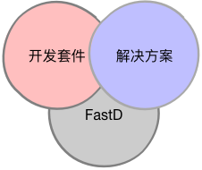

<h1 align="center">Fast-D</h1>

:rocket: A high performance PHP API framework.

FastD 是一个支持 Swoole 的轻量级 Web 开发框架，可适用于对性能有要求的 API 场景，并且灵活的扩展性可以让开发者们更容易地建造自己的服务 (基于Swoole)，

### 要求

* PHP >= 5.6
* ext-curl
* ext-pdo
* ext-swoole

### 文档

我们希望不仅仅是提供一个开发框架，更希望能够将自己的经验整理成解决方案，开发套件分享和贡献给社区。

* [中文文档](http://docs.fastdlabs.com/#/zh-cn/3.2/readme)
* [English Document](https://docs.fastdlabs.com/#/en-us/3.2/readme)

### 系列文章

* [FastD 最佳实践一: 构建 API](http://blog.fastdlabs.com/2017-12-12/create-api)
* [FastD 最佳实践二: 构建配置中心](http://blog.fastdlabs.com/2017-12-12/create-configure)
* [FastD 最佳实践三: 构建API网关](http://blog.fastdlabs.com/2017-12-12/create-gatewray)
* [FastD 最佳实践四: 构建系统可视化监控](http://blog.fastdlabs.com/2017-12-12/create-monitor)
* [FastD 最佳实践五: 构建ELK日志分析系统](http://blog.fastdlabs.com/2017-12-12/create-log)
* [FastD 最佳实践六: 为应用添加调用链监控 Zipkin](http://blog.fastdlabs.com/2017-12-12/create-zipkin)

### 周边

* [FastD Viewer](https://github.com/JanHuang/viewer)
* [FastD ORM](https://github.com/zqhong/fastd-eloquent)
* [FastD QConf](https://github.com/JanHuang/QConfServiceProvider)
* [FastD Seeder](https://github.com/RunnerLee/fastd-seeder)
* [FastD Session](https://github.com/fastdlabs/session-provider)
* [FastD HealthCheck](https://github.com/fastdlabs/health-check-provider)
* [FastD Log](https://github.com/fastdlabs/log-provider)
* [FastD Auth](https://github.com/fastdlabs/auth-provider)
* [FastD Cache](https://github.com/fastdlabs/cache-provider)
* [FastD CORS](https://github.com/fastdlabs/cors-provider)
* [FastD i18n](https://github.com/fastdlabs/i18n-provider)
* [FastD Mock](https://github.com/fastdlabs/mock-provider)
* [FastD WeChat](https://github.com/fastdlabs/wechat-provider)
* [Queue](https://github.com/RunnerLee/queue)
* [Validator](https://github.com/RunnerLee/validator)
* [Phalcon ORM](https://github.com/xueron/fastd-phalcon)

### 相关项目

* [Dobee API Framework](https://github.com/JanHuang/dobee)

### 贡献

* [yyz26371945](https://github.com/yyz26371945)
* [RunnerLee](https://github.com/RunnerLee)
* [zqhong](https://github.com/zqhong)
* [xsharp](https://github.com/xsharp)

非常欢迎感兴趣，愿意参与其中，共同打造更好PHP生态，Swoole生态的开发者。

如果你乐于此，却又不知如何开始，可以试试下面这些事情：

* 在你的系统中使用，将遇到的问题 [反馈](https://github.com/JanHuang/fastD/issues)。
* 有更好的建议？欢迎联系 [bboyjanhuang@gmail.com](mailto:bboyjanhuang@gmail.com) 或 [新浪微博:编码侠](http://weibo.com/ecbboyjan)。

### 联系

如果你在使用中遇到问题，请联系: [bboyjanhuang@gmail.com](mailto:bboyjanhuang@gmail.com). 微博: [编码侠](http://weibo.com/ecbboyjan)

## License MIT
