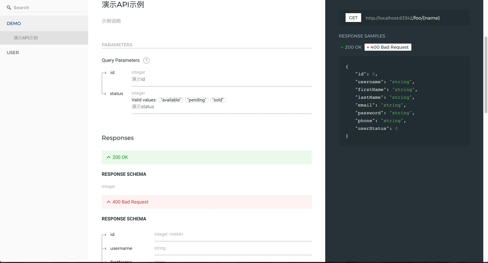

# API 文档 (已废弃，可手动集成)

* [swagger](https://github.com/zircote/swagger-php)

```php
php bin/console doc
```

命令会将数据按照 app.php 配置的应用名进行生成，打开 html 文件即可访问文档。

文档的方式通过注释进行处理，定义在控制器中，更具体的操作请前往 [swagger getting started](https://github.com/zircote/swagger-php/blob/master/docs/Getting-started.md)

### 注释示例: 

##### 控制器

```php
<?php
/**
 * @author    jan huang <bboyjanhuang@gmail.com>
 * @copyright 2016
 *
 * @link      https://www.github.com/janhuang
 * @link      https://fastdlabs.com
 */

namespace Http\Controller;

use FastD\Http\JsonResponse;
use FastD\Http\Response;
use FastD\Http\ServerRequest;

/**
 *
 * @SWG\Info(title="演示API", version="0.1")
 *
 * Class IndexController
 * @package Http\Controller
 */
class IndexController
{
    /**
     * @SWG\Get(
     *   path="/foo/{name}",
     *   summary="演示API示例",
     *   tags={"demo"},
     *   description="示例说明",
     *   consumes={"application/json", "application/xml"},
     *   produces={"application/json", "application/xml"},
     *   @SWG\Parameter(
     *     name="id",
     *     in="query",
     *     description="演示id",
     *     required=false,
     *     type="integer",
     *     @SWG\Items(type="integer", format="int32"),
     *     collectionFormat="csv"
     *   ),
     *   @SWG\Parameter(
     *     name="status",
     *     in="query",
     *     description="演示status",
     *     required=false,
     *     type="integer",
     *     enum={"available", "pending", "sold"}
     *   ),
     *   @SWG\Response(
     *     response=200,
     *     description="OK",
     *     examples={
     *          "application/json": {
     *              "id"="1",
     *              "status"="1"
     *          }
     *     },
     *     @SWG\Schema(
     *       type="integer"
     *     ),
     *     @SWG\Schema(
     *       type="object",
     *       @SWG\Property(property="error_code", type="integer", format="int32"),
     *       @SWG\Property(property="error_message", type="string")
     *     )
     *   ),
     *   @SWG\Response(response=400, description="Bad Request", @SWG\Schema(ref="#/definitions/User")),
     *   @SWG\Response(response=500, description="Internal Server Error")
     * )
     *
     * @param $request
     * @return Response
     */
    public function welcome(ServerRequest $request)
    {
        return json([
            'foo' => 'bar'
        ]);
    }

    /**
     * @param ServerRequest $request
     * @return JsonResponse
     */
    public function sayHello(ServerRequest $request)
    {
        return json([
            'foo' => $request->getAttribute('name'),
        ]);
    }

    /**
     * @param ServerRequest $serverRequest
     * @return JsonResponse
     */
    public function middleware(ServerRequest $serverRequest)
    {
        return json([
            'foo' => 'bar'
        ]);
    }

    /**
     * @return JsonResponse
     */
    public function db()
    {
        return json(
            database()->info()
        );
    }

    public function model()
    {
        $model = model('demo');

        return json([
            'model' => get_class($model),
            'db' => $model->getDatabase()->info()
        ]);
    }

    public function auth()
    {
        return json([
            'foo' => 'bar'
        ]);
    }
}
```

### 模型

```php
<?php
/**
 * @author    jan huang <bboyjanhuang@gmail.com>
 * @copyright 2016
 *
 * @link      https://www.github.com/janhuang
 * @link      https://fastdlabs.com
 */

namespace Document;


/**
 * @SWG\Definition(type="object", @SWG\Xml(name="User"))
 */
class User
{
    /**
     * @SWG\Property(format="int64")
     * @var int
     */
    public $id;

    /**
     * @SWG\Property()
     * @var string
     */
    public $username;

    /**
     * @SWG\Property
     * @var string
     */
    public $firstName;

    /**
     * @SWG\Property()
     * @var string
     */
    public $lastName;

    /**
     * @var string
     * @SWG\Property()
     */
    public $email;

    /**
     * @var string
     * @SWG\Property()
     */
    public $password;

    /**
     * @var string
     * @SWG\Property()
     */
    public $phone;

    /**
     * User Status
     * @var int
     * @SWG\Property(format="int32")
     */
    public $userStatus;
}
```

值得注意的是，Schema 中的 ref 是需要映射到一个数据模型当中，而这个数据模型会推荐存放在 Document 目录中，写法参考以上代码。

效果: 

[]

下一节: [应用配置](3-1-configuration.md)