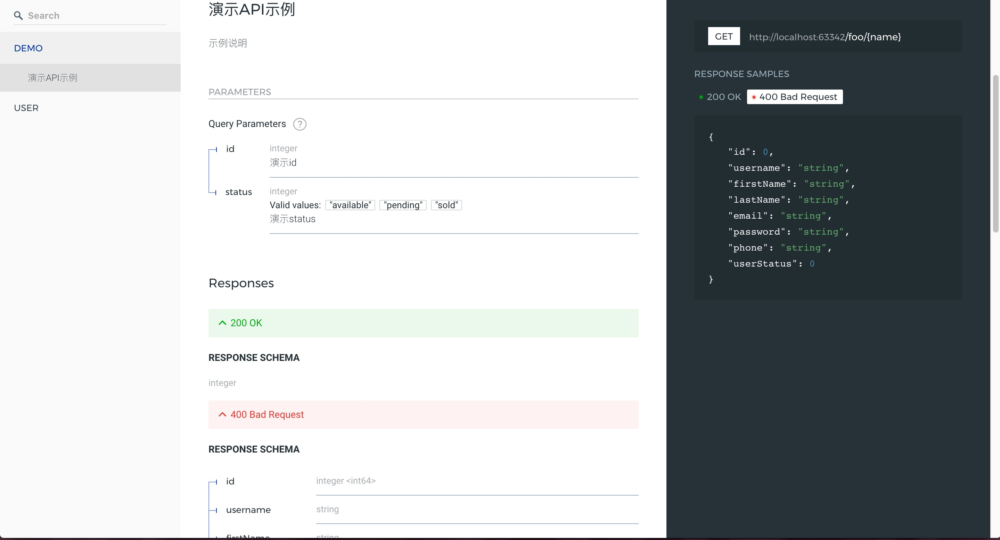

# API 文档

FastD 框架中已经默认集成 [swagger](https://github.com/zircote/swagger-php) 文档，仅需要通过以下命令即可生成文档，亦可通过集成的方式将文档集中到一个中心管理。

```php
php bin/console doc
```

命令会将数据按照 app.php 配置的应用名进行生成，打开 html 文件即可访问文档。

文档的方式通过注释进行处理，定义在控制器中，更具体的操作请前往 [swagger getting started](https://github.com/zircote/swagger-php/blob/master/docs/Getting-started.md)

##### 注释示例: 

```php
<?php
/**
 *
 */
class PetWithDocsController
{
    /**
     * @SWG\Post(
     *     path="/pets",
     *     operationId="addPet",
     *     description="Creates a new pet in the store.  Duplicates are allowed",
     *     produces={"application/json"},
     *     @SWG\Parameter(
     *         name="pet",
     *         in="body",
     *         description="Pet to add to the store",
     *         required=true,
     *         @SWG\Schema(ref="#/definitions/NewPet"),
     *     ),
     *     @SWG\Response(
     *         response=200,
     *         description="pet response",
     *         @SWG\Schema(ref="#/definitions/Pet")
     *     ),
     *     @SWG\Response(
     *         response="default",
     *         description="unexpected error",
     *         @SWG\Schema(ref="#/definitions/ErrorModel")
     *     )
     * )
     */
    public function addPet()
    {
    }
    /**
     * @SWG\Get(
     *     path="/pets/{id}",
     *     description="Returns a user based on a single ID, if the user does not have access to the pet",
     *     operationId="findPetById",
     *     @SWG\Parameter(
     *         description="ID of pet to fetch",
     *         format="int64",
     *         in="path",
     *         name="id",
     *         required=true,
     *         type="integer"
     *     ),
     *     produces={
     *         "application/json",
     *         "application/xml",
     *         "text/html",
     *         "text/xml"
     *     },
     *     @SWG\Response(
     *         response=200,
     *         description="pet response",
     *         @SWG\Schema(ref="#/definitions/Pet")
     *     ),
     *     @SWG\Response(
     *         response="default",
     *         description="unexpected error",
     *         @SWG\Schema(ref="#/definitions/ErrorModel")
     *     )
     * )
     */
    public function findPetById()
    {
    }
    /**
     * @SWG\Get(
     *     path="/pets",
     *     description="Returns all pets from the system that the user has access to",
     *     operationId="findPets",
     *     produces={"application/json", "application/xml", "text/xml", "text/html"},
     *     @SWG\Parameter(
     *         name="tags",
     *         in="query",
     *         description="tags to filter by",
     *         required=false,
     *         type="array",
     *         @SWG\Items(type="string"),
     *         collectionFormat="csv"
     *     ),
     *     @SWG\Parameter(
     *         name="limit",
     *         in="query",
     *         description="maximum number of results to return",
     *         required=false,
     *         type="integer",
     *         format="int32"
     *     ),
     *     @SWG\Response(
     *         response=200,
     *         description="pet response",
     *         @SWG\Schema(
     *             type="array",
     *             @SWG\Items(ref="#/definitions/Pet")
     *         ),
     *     ),
     *     @SWG\Response(
     *         response="default",
     *         description="unexpected error",
     *         @SWG\Schema(
     *             ref="#/definitions/ErrorModel"
     *         )
     *     ),
     *     @SWG\ExternalDocumentation(
     *         description="find more info here",
     *         url="https://swagger.io/about"
     *     )
     * )
     */
    public function findPets()
    {
    }
    /**
     * @SWG\Delete(
     *     path="/pets/{id}",
     *     description="deletes a single pet based on the ID supplied",
     *     operationId="deletePet",
     *     @SWG\Parameter(
     *         description="ID of pet to delete",
     *         format="int64",
     *         in="path",
     *         name="id",
     *         required=true,
     *         type="integer"
     *     ),
     *     @SWG\Response(
     *         response=204,
     *         description="pet deleted"
     *     ),
     *     @SWG\Response(
     *         response="default",
     *         description="unexpected error",
     *         @SWG\Schema(ref="#/definitions/ErrorModel")
     *     )
     * )
     */
    public function deletePet()
    {
    }
}
```

效果: 

[]

下一节: [应用配置](3-1-configuration.md)