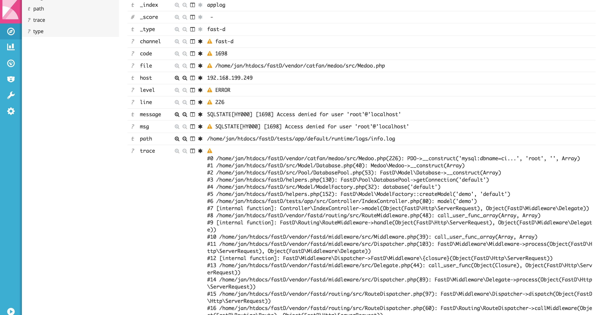

# 监控

相对于PHP开发者，我们深感到开发者的不容易。从开发，到运维，到故障排查和解决问题。因此我们也基于 [ELK](https://www.elastic.co/) 整合到了业务开发框架中，作为其中的一种日志方式。

使用 ELK 可以很方便地记录我们应用日志，能够将分布多处的业务统一回收到一个地方进行集中分析。

#### 环境要求:

* swoole > 1.9.9
* elasticsearch >= 5.0
* logstash >= 5.0
* kibana >= 5.0

#### 效果图:  



#### 使用

设置 `app.php` 日志格式库 `\FastD\Logger\Formatter\StashFormatter::class`，对其日志进行统一处理即可完成配置。

示例:
 
```php
<?php

return [
    // code ...
    'log' => [
        [
            \Monolog\Handler\StreamHandler::class,
            'info.log',
            \FastD\Logger\Logger::INFO,
            \FastD\Logger\Formatter\StashFormatter::class,
        ],
    ],
    // code ...
];
```

> 开启日志统一采集处理前提需要安装 ELK 日志分析系统。可参考: [ELK中文指南](https://kibana.logstash.es/content/logstash/get-start/install.html)

开启 `logstash` 对日志进行采集推送 `bin/logstash -f path/to/log`

完成后，可以访问业务程序，产生日志对其进行测试。
